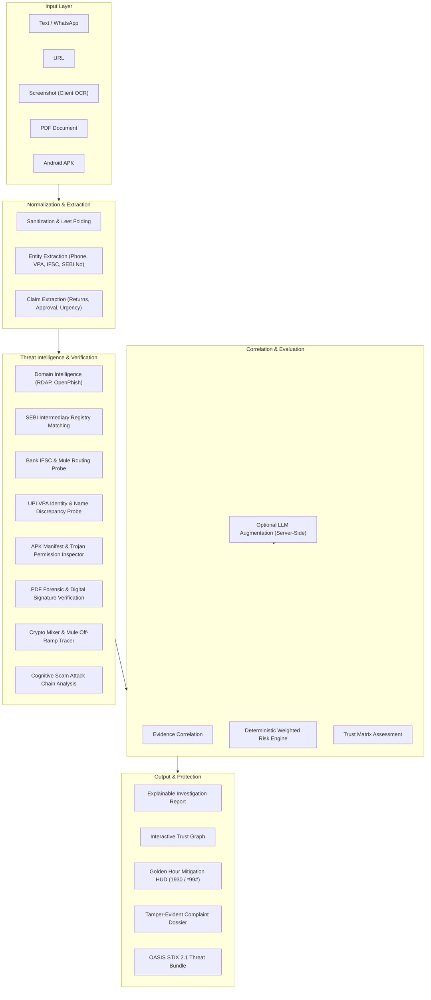

# RAKSHAK

> Verify Before You Trust.

RAKSHAK is an explainable financial threat-intelligence and investor-defense platform built for India's financial threat landscape.

---

## What is RAKSHAK?

Financial fraud in India has evolved beyond basic phishing links into coordinated multi-vector deceptions—including regulatory impersonation, fake SEBI certificates, typo-squatted investment portals, malicious banking APKs, and mule bank account networks.

RAKSHAK provides deterministic, evidence-grounded threat interrogation. It analyzes suspicious investment solicitations across text, screenshots, URLs, APK manifests, and documents, cross-referencing extracted claims and financial identifiers against authoritative registries and threat feeds to produce an explainable risk verdict.

---

## Why RAKSHAK?

Conventional security tools typically stop at binary checks:
- Is this specific URL on a domain blocklist?
- Does this file match a known antivirus hash?
- Does this message contain flagged spam keywords?

These single-point checks fail against sophisticated financial fraud, where scammers routinely cycle through fresh unlisted domains, misuse authentic institution names, or solicit funds via legitimate UPI payment rails.

RAKSHAK connects the complete investigative chain:

```
Message → Claim → Entity → Registry → Domain → Payment → Evidence → Risk → Action
```

---

## Core Investigation Loop

### 1. Detect
Extracts claims, guarantees, regulatory registration assertions, phone numbers, UPI VPAs, bank IFSC routing codes, and crypto addresses from unstructured inputs.

### 2. Verify
Cross-references entities, domains, regulatory claims, and payment identifiers against official registries (SEBI, NSDL, NPCI, RBI routing) and live threat feeds (OpenPhish, RDAP, Wayback Archive).

### 3. Explain
Translates analytical findings into clear, factor-weighted evidence. The system shows exact mathematical contributions to the risk score rather than treating risk as an opaque prediction.

### 4. Protect
Delivers context-aware protective actions, including immediate emergency workflows (1930 Cybercrime Helpline, `*99#` USSD bank lien freezing, and pre-formatted evidence complaint dossiers).

---

## Architecture



---

## Key Capabilities

- **Multi-Modal Ingestion**: Direct analysis of text messages, URLs, screenshots (via client-side OCR), PDF documents, and APK manifests.
- **SEBI Intermediary Verification**: Direct matching against recognized SEBI intermediary registration formats with typo-squatting detection.
- **Live Threat Verification**: Parallel querying of RDAP domain age, OpenPhish threat intelligence feeds, and Wayback historical records with in-memory caching and offline degradation.
- **SSRF-Protected URL Fetching**: Defense-in-depth URL inspection blocking cloud metadata (169.254.x.x), RFC1918 private subnets, loopbacks, and carrier-grade NAT before text extraction.
- **Banking & UPI Forensics**: Decodes bank branches via IFSC codes, flags known cybercrime mule zones, and identifies individual P2P VPAs posing as corporate entities.
- **Android Banking Trojan Inspection**: Identifies high-risk Android permissions (SMS interception, Accessibility services abuse, system overlays) in APK metadata.
- **PDF Certificate Forensics**: Detects consumer graphics templates (Canva/Photoshop) claiming to be government or regulatory certificates and flags missing Class-3 DSC cryptographic signatures.
- **Explainable Risk Scoring**: Additive factor model detailing exactly how points are accrued across deceptive signals, solicitation pressure, verification gaps, and source credibility.
- **Interactive Trust Graph**: Visual relational network mapping persons, organizations, domains, phone numbers, and payment rails with status indicators.
- **Golden Hour Crisis Protocol**: Instant loss-mitigation workflow for victims of financial fraud (direct 1930 dialing, `*99#` USSD inter-bank lien freezing, and 1-click bank portal links).
- **OASIS STIX 2.1 Export**: Generates standardized threat-intelligence bundles (Indicators of Compromise) for security operation centers and law enforcement.
- **Multi-Lingual Support**: Native interface and investigative reporting in English, Hindi (हिन्दी), and Gujarati (ગુજરાતી), with Simple Mode explanations.
- **Browser Shield Extension**: Manifest V3 extension monitoring link navigation and warning users before visiting fraudulent financial domains.

---

## Technology Stack

- **Framework**: [Next.js 16 (App Router)](https://nextjs.org/)
- **Core Runtime**: [React 19](https://react.dev/)
- **Styling**: [Tailwind CSS v4](https://tailwindcss.com/)
- **Client-Side OCR**: [Tesseract.js](https://tesseract.projectnaptha.com/)
- **Testing & Verification**: [TypeScript](https://www.typescriptlang.org/), [Playwright](https://playwright.dev/)
- **Deployment**: Node.js or Edge serverless runtime

---

## Project Structure

```
rakshak/
├── app/                        # Next.js App Router (Pages & API routes)
│   ├── api/analyze/            # Server-side analysis endpoint
│   ├── dashboard/              # Threat Center overview
│   ├── extension/              # Browser extension download & setup
│   ├── incident/[id]/          # Saved investigation permalinks
│   ├── investigate/            # Core investigation surface
│   ├── locker/                 # Evidence Locker archive
│   └── settings/               # Privacy, language, and session settings
├── components/                 # React UI components
│   ├── dashboard/              # Threat Center components & metrics
│   ├── graph/                  # Interactive Trust Graph visualization
│   ├── investigate/            # Input surface & analysis states
│   ├── landing/                # Homepage & product preview
│   ├── locker/                 # Evidence Locker interface
│   ├── report/                 # Forensic cards, Golden Hour, Dossier
│   ├── site-chrome.tsx         # Institutional header and footer
│   └── ui.tsx                  # Base design primitives
├── extension/                  # Manifest V3 Chrome/Edge extension source
├── lib/                        # Core application & forensic logic
│   ├── ai/llm.ts               # Optional LLM extraction augmentation
│   ├── analyze/                # 24 deterministic forensic engines
│   ├── localization/           # English, Hindi, and Gujarati dictionaries
│   └── storage/locker.ts       # Client-side evidence persistence
├── public/                     # Static assets & compiled extension zip
├── tests/                      # Automated unit and integration test suite
├── types/                      # TypeScript definitions (Report, Intel, STIX)
├── .env.example                # Environment variable configuration template
├── package.json                # Project dependencies and test scripts
└── README.md                   # System documentation
```

---

## Getting Started

### Prerequisites
- Node.js 18.17+ or Node.js 20+
- npm (or yarn / pnpm)

### Installation

1. Clone the repository:
   ```bash
   git clone https://github.com/naxupa96/rakshak.git
   cd rakshak
   ```

2. Install dependencies:
   ```bash
   npm install
   ```

3. (Optional) Configure environment variables:
   ```bash
   cp .env.example .env.local
   ```
   *Note: RAKSHAK's core deterministic rules and intelligence engines operate without external API keys.*

4. Launch the local development server:
   ```bash
   npm run dev
   ```

5. Open [http://localhost:3000](http://localhost:3000) in your browser.

---

## Environment Variables

All core analytical engines operate 100% deterministically without environment variables. To optionally augment entity extraction using an external language model, configure the following server-side variables in `.env.local`:

| Variable | Description | Default |
| :--- | :--- | :--- |
| `OPENAI_API_KEY` | OpenAI API key for server-side entity extraction | *None (optional)* |
| `OPENAI_BASE_URL` | Base URL for OpenAI API or compatible endpoints | `https://api.openai.com/v1` |
| `ANTHROPIC_API_KEY` | Anthropic API key for extraction augmentation | *None (optional)* |
| `LLM_MODEL` | Model identifier override | `gpt-4o-mini` / `claude-sonnet-4-5` |
| `PORT` | Local server port | `3000` |

---

## Development & Verification

Execute the following commands to verify code quality and suite integrity:

```bash
# Run unit test suite (25/25 automated engine tests)
npm test

# Run linter
npm run lint

# Compile production build
npm run build
```

---

## Security Model

- **Client-Side Privacy**: Screenshot OCR is executed locally in the browser using WebAssembly workers (`tesseract.js`). Unsaved inputs are not persisted to a server database.
- **Automated PII Redaction**: Phone numbers, e-mail addresses, and sensitive identifiers are masked in report previews (`redactReport`).
- **SSRF Defense**: External URL inspection enforces multi-hop IP resolution checks, blocking loopback addresses, RFC1918 private subnets, link-local metadata endpoints (`169.254.169.254`), and non-HTTP protocols.
- **Fail-Safe Degradation**: If external threat feeds (RDAP/OpenPhish) time out or become unreachable, the system transparently notes source unavailability rather than failing or reporting false clearance.
- **HTTP Security Headers**: Next.js configuration enforces `X-Content-Type-Options: nosniff`, `X-Frame-Options: DENY`, `Referrer-Policy: strict-origin-when-cross-origin`, and restrictive permissions policies.

---

## Risk & Explainability

RAKSHAK computes an additive risk score ($0–100$) derived from discrete, verifiable indicators:

$$\text{Risk Score} = \min\left(100, \, \left(\sum_{i} \text{Points}_i \times \text{Weight}_i\right) \times \text{Context Multiplier}\right)$$

### Factor Weights:
- **Deceptive Signals ($45\%$)**: Guaranteed returns, zero-risk assertions, upper-circuit manipulation, urgent countdowns, and digital arrest threats.
- **Solicitation ($20\%$)**: Demands for upfront fees, direct UPI links, crypto transfers, or OTP disclosures.
- **Verification Gap ($15\%$)**: Unverifiable or missing regulatory registration numbers, newly created domains ($<7$ days), or lack of corporate provenance.
- **Source Credibility ($10\%$)**: Discrepancies between claimed entities and contact channels (e.g., SEBI broker using a free webmail handle or Telegram group).
- **Pressure & Isolation ($10\%$)**: Demands for secrecy (*"do not tell your bank/family"*) and manufactured urgency.

*Context Adjustment: Educational and journalistic text containing quoted scam warnings is explicitly down-weighted via context detection.*

---

## Emergency Safety Protocols

For incidents involving immediate financial loss, RAKSHAK provides step-by-step guidance aligned with Indian cybercrime reporting infrastructure:
- **National Cybercrime Helpline**: Direct integration with **1930** (formerly 155260).
- **NPCI USSD Lien Freeze**: Guidance on dialing `*99#` for immediate inter-bank UPI transaction freezing within the critical 60–120 minute window.
- **National Cyber Crime Portal**: Direct linkage to [cybercrime.gov.in](https://cybercrime.gov.in).
- **Evidence Locker & Dossier**: One-click generation of a tamper-evident complaint dossier containing cryptographic transaction hashes, intercepted communication excerpts, and mule account identifiers for submission to police or bank nodal officers.

---

## Limitations

- **Analytical Indicator, Not Absolute Proof**: A high risk score indicates the presence of recognized financial manipulation patterns; it does not constitute a formal judicial finding of fraud.
- **Third-Party Availability**: RDAP and open-source threat feeds may experience latency or intermittent rate limits; when feeds are unavailable, the system explicitly reports status as *Unavailable*.
- **Evasion Tactics**: Emerging synthetic text and newly registered payment rails may not match known heuristic signatures immediately.
- **Independent Confirmation**: RAKSHAK assists in claim evaluation; users should verify critical investment offerings through official regulator portals ([sebi.gov.in](https://www.sebi.gov.in), [nsdl.co.in](https://www.nsdl.co.in)).

---

## Responsible Use

RAKSHAK is an investor-protection and financial threat intelligence tool designed exclusively for defensive and investigative purposes. It does not provide investment advice, credit evaluations, or automated commercial transaction blocking.

---

## Contributing

Contributions are welcome. Please ensure that all modifications include corresponding test coverage and adhere to the deterministic verification model:

1. Fork the repository.
2. Create a feature branch (`git checkout -b feature/defense-enhancement`).
3. Commit your changes (`git commit -m 'feat: add detection for new fraud vector'`).
4. Ensure all unit tests pass (`npm test`).
5. Open a Pull Request.

---

## License

This repository is maintained for security evaluation and investor protection research. Currently, no explicit open-source license is granted. All rights reserved.
